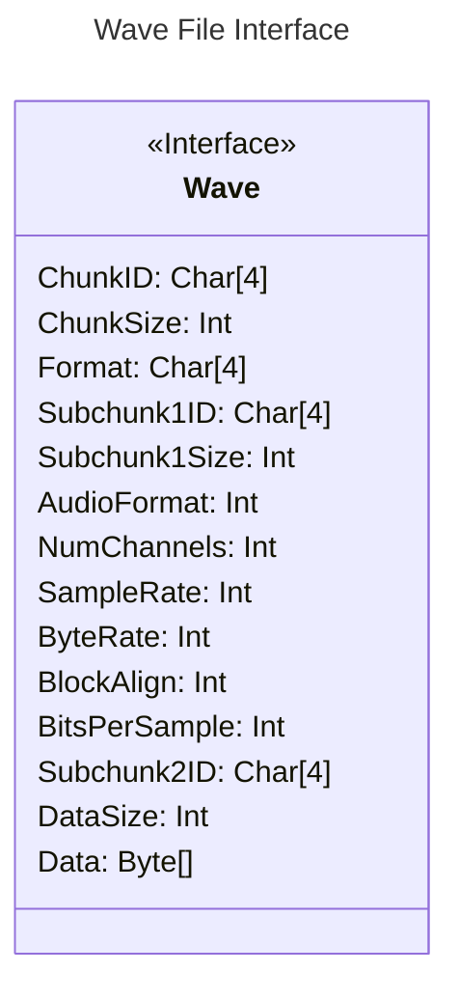

# Documentation

```mermaid
---
title: Wave File Interface
---

classDiagram
    class Wave{
        ChunkID: Char[4]
        ChunkSize: Int
        Format: Char[4]
        Subchunk1ID: Char[4]
        Subchunk1Size: Int
        AudioFormat: Int
        NumChannels: Int
        SampleRate: Int
        ByteRate: Int
        BlockAlign: Int
        BitsPerSample: Int
        Subchunk2ID: Char[4]
        DataSize: Int
        Data: Byte[]
    }

<<Interface>> Wave
```
